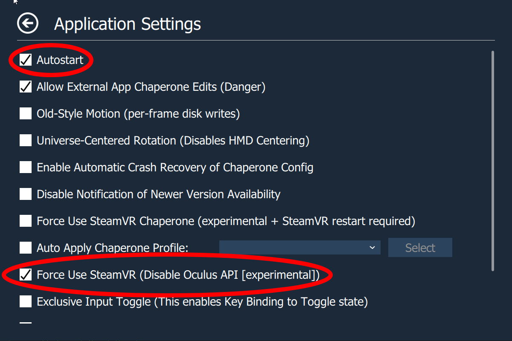

# Oculus Killer

Welcome to Oculus Killer! This tool is designed to enhance your VR experience by seamlessly integrating Oculus with SteamVR. With Oculus Killer, you can transform your Oculus headset into an almost-native SteamVR headset. Say goodbye to the resource-hungry Oculus Dash and hello to a smoother, more efficient VR experience.

## Features

- **Auto-Launch SteamVR**: As soon as you put on your headset or launch Link, SteamVR will start automatically.
  
- **Performance Boost**: Oculus Dash, known for consuming significant memory and GPU resources, is completely killed, freeing up resources for a smoother VR experience.

- **Simplified Experience**: With Oculus Dash out of the picture, the Oculus button on your controller won't interrupt your VR sessions.

## Installation

To get started with Oculus Killer, follow these steps:

1. Open Task Manager, navigate to Services, and locate `OVRService`. Right-click on it and select 'Stop'. (Note: If you have the Oculus app or any VR games open, they will close when stopping `OVRService`.)
2. Navigate to `C:\Program Files\Oculus\Support\oculus-dash\dash\bin` in File Explorer.
3. Rename the original `OculusDash.exe` to `OculusDash.exe.bak` and move the Oculus Killer's `OculusDash.exe` into the folder.
4. Return to Task Manager, locate `OVRService` again, right-click on it, and select 'Start'.

You're all set! Enjoy your enhanced VR experience with Oculus Killer.

## Common Fixes

Encountering issues? Here are solutions to some common problems:

### Headset Infinitely Loads (SteamVR doesn't launch)

This can occur if "File name extensions" aren't enabled when renaming `OculusDash.exe`. To resolve:

- Open "File Explorer".
- Click the "View" tab.
- Enable "File name extensions".
- Follow the installation instructions again.

### OpenXR Games launch, but cannot be seen

This issue arises due to OpenXR's preference for Oculus over SteamVR. Here's a simple fix:

- Connect your headset and open SteamVR settings.
- Click "Show" under "Advanced Settings".
- Navigate to the "Developer" tab.
- Click "Set SteamVR as OpenXR runtime".

*Image Source: [Viveport](https://service.viveport.com/hc/en-us/articles/4423262844813-How-to-setup-correct-OpenXR-runtime)*

### Non-OpenXR Games launch, but cannot be seen

Some games manually check for Oculus instead of following your preferences. A workaround involves using [OVR Advanced Settings](https://store.steampowered.com/app/1009850/OVR_Advanced_Settings/):

- Install and launch [OVR Advanced Settings](https://store.steampowered.com/app/1009850/OVR_Advanced_Settings/).
- Access the new overlay (next to the desktop button).
- Open overlay settings (bottom left).
- Enable "Autostart".
- Turn on "Force Use SteamVR (Disable Oculus API [experimental])".

## Disclaimer

Using Oculus Killer may affect Oculus-based games. You might launch Oculus games, but without Oculus Dash, you'll remain in that game. For playing Oculus versions of games, it's recommended to use Revive.
